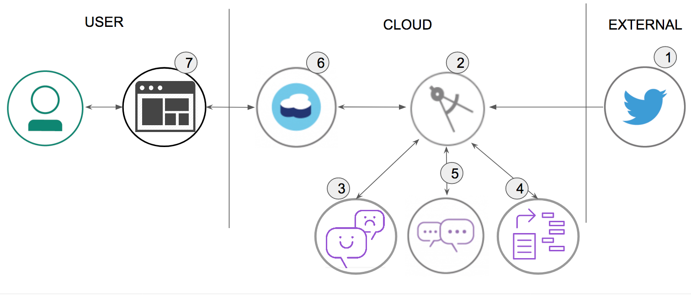

[](https://travis-ci.org/IBM/cognitive-social-crm)

# Watson Assistant、Tone Analyzer、Natural Language Understandingを活用して顧客の感情をよりよく理解するためにTwitterフィードを監視する

> Watson Conversation は、現在 Watson Assistant です。このコードパターンの一部の画像では、Watson Conversationとして表示されることがありますが、手順やプロセスはそのままで動作します。

In this journey, our server application subscribes to a Twitter feed as configured by the user. Each tweet received will be analyzed for emotional tone and sentiment, and the intent of the tweet will be determined by the Watson Assistant service. All data is stored in a Cloudant database, with the opportunity to store historical data as well. The resulting analysis is presented in a Web UI as a series of graphs and charts.
Credit goes to [Werner Vanzyl](https://www.linkedin.com/in/werner-vanzyl-326a589) as the author of the original code and documents.

このコースを終えると、以下のことができるようになります:

* Twitterのフィードを監視するアプリケーションの実行する  
* Watson Tone Analyzer、Assistant、and Natural Language Understanding にツイートを送信して処理と分析を行う  
* 情報を Cloudant データベースに格納する  
* Node.js web UI に情報を表示させる  
* 特定のTwitterハンドルまたはハッシュタグのツイートをキャプチャして分析し、Watson にコンテンツを分析させる

## 全体の操作の流れ



1. ツイートがTwitter によってプッシュされる
2. Cognitive Social CRM アプリ(server.js) はツイートを処理する
3. Watson Tone Analyzer サービスは、感情や感情の分析を行う
4. Watson Assistant サービスは、ツイートからインテントを抽出する
5. Watson Natural Language Understanding サービスは、キーワードとエンティティを抽出する
6. ツイートやメタデータは Cloudant に保存される
7. Web UI にチャートやグラフ、ツイートを表示する

## 利用するコンポーネント

* [Watson Assistant](https://www.ibm.com/watson/services/conversation): Build, test and deploy a bot or virtual agent across mobile devices, messaging platforms, or even on a physical robot.
* [Watson Tone Analyzer](https://www.ibm.com/watson/services/tone-analyzer): Uses linguistic analysis to detect communication tones in written text.
* [Watson Natural Language Understanding](https://www.ibm.com/watson/services/natural-language-understanding): Natural language processing for advanced text analysis.
* [IBM Cloudant](https://www.ibm.com/analytics/us/en/technology/cloud-data-services/cloudant): A managed NoSQL database service that moves application data closer to all the places it needs to be — for uninterrupted data access, offline or on.
* [Cloud Foundry](http://cloudfoundry.org/): Build, deploy, and run applications on an open source cloud platform.

## 注目のテクノロジー

* [Artificial Intelligence](https://medium.com/ibm-data-science-experience): Artificial intelligence can be applied to disparate solution spaces to deliver disruptive technologies.
* [Databases](https://en.wikipedia.org/wiki/IBM_Information_Management_System#.22Full_Function.22_databases): Repository for storing and managing collections of data.
* [Node.js](https://nodejs.org/): An open-source JavaScript run-time environment for executing server-side JavaScript code.

# 解説動画 (英語)

[](https://youtu.be/aWKi4f6gytc)

# 手順

セットアップで行うこととして、大きくは3つのステップがあります。コードをダウンロードしてアプリケーションをセットアップし、コードをIBM Cloudにデプロイします。コードをローカルで実行する場合は、ローカルで資格情報を設定する手順がもう1つ必要になります。

1. [リポジトリーのクローン](#1-clone-the-repo)
2. [依存関係のインストール](#2-install-dependencies)
3. [Twitter アカウントとアプリケーションの準備](#3-twitter-requirements)
4. [IBM Cloud 上で Watson APIサービスの作成](#4-create-watson-services-with-ibm-cloud)
5. [Assistant workspaceのインポート](#5-import-the-conversation-workspace)
6. [資格情報の設定](#6-configure-credentials)
7. [アプリケーションの実行](#7-run-the-application)

### 1. リポジトリーのクローン

`cognitive-social-CRM` をローカルにクローンします。ターミナルで次のコマンドを実行します。

```
$ git clone https://github.com/IBM/cognitive-social-crm
$ cd cognitive-social-crm
```

Watson Assistantワークスペースを設定するには、ファイル [`data/conversation/workspaces/workspace-social-crm-airline-classification.json`](data/conversation/workspaces/workspace-social-crm-airline-classification.json) を使用します。

### 2. 依存関係のインストール

本アプリケーションを動作させるためには、次のソフトウェアをローカルにインストールしてある環境が必要になります。

1. [Node (6.9+)](https://nodejs.org): アプリケーションランタイム環境。サイトからパッケージをダウンロードしてインストールします。
1. [Angular CLI (1.0.0)](https://www.npmjs.com/package/@angular/cli): Angularアプリケーション用CLI。インストールする場合は npm install コマンド実行してください。  
 `npm install -g @angular/cli`

> Angular CLIが既にインストールされている環境で、ソフトウェアをアップグレードする場合は、Angular CLIのアップグレード手順をお読みください。

アプリケーションフォルダーから次のコマンドを実行して、クライアントとサーバーの両方の依存関係をインストールします。

```
$ npm install
```

### 3. Twitter アカウントとアプリケーションの準備

このアプリケーションで特定のハンドルまたはハッシュタグからツイートを購読するには、TwitterアカウントとTwitterアプリケーションを作成する必要があります。 Twitterアカウントは、他のTwitterユーザーからのメッセージを受信するアカウントとして使用されるだけでなく、Twitterで必要なアプリケーションの所有者として使用します。
* [Twitter](https://twitter.com/signup) で作成した新規アカウント、または既存のアカウントを使用してください。 Twitterアカウントに、任意の電子メールアドレスの関連づけ、アカウントを確認するための電話番号を登録する必要があります。
* Twitterアカウントを作成後、 [Twitter Dev](https://apps.twitter.com/) へアクセスし、「Create New App」からTwitterアプリケーションを作成します。
* 「Keys and Access Tokens」タブで、Consumer KeyとConsumer Secretが生成されていることを確認し、「Create my access token」ボタンで Access TokenとAccess Token Secretも生成しておきます。これらのトークン情報は、後ほどアプリケーションの設定手順に使用するため、ページを開いたままにしておきます。

### 4. IBM Cloud 上で Watson APIサービスの作成

IBM Cloud DeploymentまたはSetup Local Deploymentのいずれかを設定します。

#### IBM Cloud Deploymentの設定

> 解説: You will create a placeholder application in IBM Cloud that connects to all the required services first.必要なすべてのサービスに最初に接続する、IBM Cloudにプレースホルダー・アプリケーションを作成します。

1. IBM Cloudアカウントをお持ちでない場合は、  [ライト・アカウント登録](ibm.biz/ibmcloud_free) をしてください。
2.  [Cloud Foundry CLI](https://console.bluemix.net/docs/cli/index.html#cli) ツールをダウンロードして、インストールします。
3. IBM Cloudにログインしてください。
4. `ダッシュボード` から新しく `リソースの作成` を行います。  
  - On the left, select `Apps` > `Cloudfoundry Apps`.
  - 左側メニューから `Cloud Foundry アプリ` を選択する
  - 右側に表示された画面から `SDK for Node.js` を選択して作成する
  - アプリケーションに任意の名前を付ける
5. アプリケーションを作成した後は、アプリケーションの概要ページの `接続の作成` を選択します。
6. 新しく作成したコンポーネント `Watson Assistant`、 `Natural Language Understanding`、 `Tone Analyzer`、および `Cloudant NoSQL DB` を [Connect] ボタンをクリックしてバインドします。
7. Leave the `Connections` page open, as you will reference the credentials in the next step.

#### ローカルでデプロイするためのセットアップ方法

> 解説: IBM Cloud サービスを作成し、ローカルで稼動するサーバー・アプリで使用するように構成します。

IBM Cloudアカウントをお持ちでない場合は[ライト・アカウント登録](ibm.biz/ibmcloud_free) をし、次のサービスを作成してください。

* [**Watson Assistant**](https://console.bluemix.net/catalog/services/conversation)
* [**Watson Tone Analyzer**](https://console.bluemix.net/catalog/services/tone-analyzer)
* [**Watson Natural Language Understanding**](https://console.bluemix.net/catalog/services/natural-language-understanding)
* [**IBM Cloudant DB**](https://console.bluemix.net/catalog/services/cloudant-nosql-db)

### 5. Assistant workspace をインポートする

作成した **Watson Assistant** から「管理」内の「ツールを起動」し、Workspacesタブの右上の矢印アイコン(Import Workspace)を選択します。

ローカルに保存された [`data/conversation/workspaces/workspace-social-crm-airline-classification.json`](data/conversation/workspaces/workspace-social-crm-airline-classification.json) ファイルを指定し、Importします。  
**重要** 作成した **Workspace ID** が記載されたタイルの右上の３つ点々を選択し、 **View details** を選択し、Workspace IDを表示し、後ほど使用する時までメモして保管しておきます。

### 6. 資格情報の設定

アプリケーションをIBM Cloudまたはローカルで実行する前に `env-vars-example.json` ファイルを `env-vars.json` としてファイルのコピーをしておきます。

> `env-vars.json` ファイルは、このアプリケーションのすべてのパラメータを格納するためのものです。後ほど説明するセットアップユーティリティは、このファイルのいくつかのパラメータの設定をガイドしますが、いつでも戻って変更することができます。


#### サービス資格情報を構成する

IBM Cloud の各サービスの資格情報 (Assistant、 Tone Analyzer、
Natural Language Understanding、および Cloudant)は、``CloudFoundry サービス`` の ``サービス資格情報`` から得ることができます。

``WORKSPACE_ID``については、上記の手順を参考にしながら入手してください。

 [`env-vars-example.json`](env-vars-example.json) を `env-vars.json` にコピーします。

```
$ cp env-vars-example.json env-vars.json
```
`env-vars.json` ファイルを必要に応じて編集してください。
Cloudant と Twitter の設定は、次のステップで `npm run setup` を実行してセットアップユーティリティを起動し、その中で入力します。これらの変数は必要に応じて手作業で編集できますが、Cloudantに適用するためにはセットアップユーティリティが必要です。

#### `env-vars-example.json:`

```
{

  "CLOUDANT_CONNECTION_URL": <populated by `npm run setup`>,
  "CLOUDANT_USERNAME": <populated by `npm run setup`>,
  "CLOUDANT_PASSWORD": <populated by `npm run setup`>,
  "CLOUDANT_ANALYSIS_DB_NAME": "analysis-db",
  "CLOUDANT_CONVERSATION_STATE_DB_NAME": "conversation-state-db",

  "CONVERSATION_API_URL": "",
  "CONVERSATION_API_USER": "",
  "CONVERSATION_API_PASSWORD": "",
  "CONVERSATION_CLASSIFICATION_WORKSPACE_ID": "",

  "NLU_API_USER": "",
  "NLU_API_PASSWORD": "",

  "TONE_ANALYZER_USER": "",
  "TONE_ANALYZER_PASSWORD": "",

  "TWITTER_CONSUMER_KEY": <populated by `npm run setup`>,
  "TWITTER_CONSUMER_SECRET": <populated by `npm run setup`>,
  "TWITTER_ACCESS_TOKEN": <populated by `npm run setup`>,
  "TWITTER_ACCESS_SECRET": <populated by `npm run setup`>,
  "TWITTER_LISTEN_FOR": "populated by `npm run setup`",
  "TWITTER_FILTER_FROM": "populated by `npm run setup`",
  "TWITTER_FILTER_CONTAINING": "populated by `npm run setup`",
  "TWITTER_PROCESS_RETWEETS": false,
  "TWITTER_RECEIVER_START_AT_BOOT": true,
  "TWITTER_CHATBOT_SCREENNAME": <populated by `npm run setup`,
  "TWITTER_CHATBOT_START_AT_BOOT": true
}

```

#### セットアップユーティリティを実行する

本アプリケーションは、セットアップユーティリティを介してアプリケーションが必要とする設定ファイルを更新することでCloudant DBに反映させることができます。セットアップユーティリィは、Twitterをテストしてデータベース照会することもできます。

作業ディレクトリ(ダウンロードしたコードを格納している場所)で次のコマンドを実行します。

```
$ npm run setup
```

セットアップユーティリティは、いくつかのメニューで構成されています。

#### Cloudant

アプリケーションを実行するために必要なデータベースが作成され、すべてのドキュメントとインデックスがロードされます。 Cloudantのユーザー名とパスワードは、IBM Cloud内のCloudantサービスの資格情報から入手することができます。

#### Twitter

Twitterに接続するだけでなく、ツイートを購読するのに必要なパラメータ設定を更新します。 dev.twitter.comからConsumer Key（API Key）、Consumer Secret Key（API Securet）、Access Token、Access Token Securetを入手する必要があります。

At this point you should have decided what Twitter handle you will be "listening" to.  The [Watson Assistant Intents](https://console.bluemix.net/docs/services/conversation/intents.html#defining-intents) for this journey are configured to work with a Twitter account for an airline, but you could create relevant intents for whichever business domain you wish. The Twitter handle would be something other people would tweet to, for example [`@aircanada`](https://twitter.com/AirCanada).  This value is what Twitter would use as trigger to send you the tweets.

> NOTE: Due to the potential for a large volume of API calls, this Accelerator will work best with a paid subscription to IBM Cloud.  If you try and use this accelerator on an screen name that produces a lot of tweets, then you take the risk of using up your free allocation of API calls very quickly.  The Accelerator will suspend for 15 minutes listening to tweets if there are errors returned from the enrichment pipeline.  When the receiver on the UI is paused, it usually means you have exceeded your limit for the day.

When you select the `Twitter` option on the main menu of the setup utility, you will be required to enter the Twitter Tokens first.  Continue to enter the screen name you are listening to, the Assistant API workspace id for the classifications, and finally the Chatbot screen name and Assistant API workspace for the Dialog implementation.

##### Testing Twitter

Twitterのパラメータをテストします。セットアップユーティリティのメインメニューからこのオプションを選択すると、リスナーが起動し、ツイートが受信され、コンソールに表示されます。パラメータの一部が正しくない場合は、エラーが表示されます。

##### Searching for Tweets

> Note: この機能を活用するには、ローカルでセットアップが完了してある必要があります。

過去のツイートをデータベースに取り込みたいことがあったとします。このアクセラレータは、「listen to」で指定したツイートを取り扱うために、7日間さかのぼって検索することができます。濃縮したツイートをデータベースに格納します。

### 6. アプリケーションの実行

`IBM Cloud 上でアプリを実行する` または `ローカルでアプリを実行する`

#### IBM Cloud 上でアプリを実行する

以前に作成したアプリケーションの名前を使用して、構成ファイルをローカルに更新します。

1. `manifest.yml` ファイルを開き、`name` と `host` の中にIBM Cloud上で作成した任意のアプリケーション名を入力します。

2. 次のコマンドを使用してAngular 2のクライアントコードをコンパイルします。

  ```
  $ npm run build:client
  ```
3. コマンドライン・ツールでIBM Cloudに接続し、プロンプトに従って、ログインします。  
> Note: 必要に応じてAPIエンド・ポイントを変更してください。ngは米国南部です。

  ```
  $ cf login -a https://api.ng.bluemix.net
  ```
4. アプリケーションをIBM Cloudにプッシュします。

  ```
  $ cf push
  ```
5. アプリケーションは、IBMクラウド上で動作し、ツイートを監視し始めます。アプリケーションURLには、 `manifest.yml`ファイルで定義したアプリケーション名を '.mybluemix.net'に追加してアクセスできます。

6. アプリケーションはユーザー名とパスワードで保護されています。詳細は、このREADMEの最後を参照してください。

#### ローカルでアプリを実行する

すべての資格情報が設定されると、アプリケーションは次の方法で稼働できます。

```
$ npm run develop
```

## 本アプリケーションへのアクセス

アプリケーションにアクセスするために、１ユーザーが用意されています。ユーザー名 `watson`、パスワード `p@ssw0rd` 。

ユーザー名とパスワードは `/server/boot/init-access.js` ファイルで変更できます。

## カスタマイズ

アプリケーションは、独自のTwitterのスクリーン名を使用して監視することや、会話のワークスペースを別にすることができます。

1. サーバコンポーネントは `env-vars.json`ファイルで設定されます。
2. クライアントは `client/src/app/shared/config.service.ts` ファイル内で変更可能な設定があります。

## サンプル

You will see informations about Tweets:


as well as Classification of live tweets, Sentiment over time, Emotional Tone over time, and Keywords mentioned:


# リンク集
* [Watson Assistant](https://www.ibm.com/watson/services/conversation/)
* [Watson Tone Analyzer](https://www.ibm.com/watson/services/tone-analyzer/)
* [Watson Natural Language Understanding](https://www.ibm.com/watson/services/natural-language-understanding/)
* [IBM Cloudant db](https://www.ibm.com/cloud/cloudant)

# 追加情報

* **Artificial Intelligence Code Patterns**: Enjoyed this Code Pattern? Check out our other [AI Code Patterns](https://developer.ibm.com/code/technologies/artificial-intelligence/).
* **AI and Data Code Pattern Playlist**: Bookmark our [playlist](https://www.youtube.com/playlist?list=PLzUbsvIyrNfknNewObx5N7uGZ5FKH0Fde) with all of our Code Pattern videos
* **With Watson**: Want to take your Watson app to the next level? Looking to utilize Watson Brand assets? [Join the With Watson program](https://www.ibm.com/watson/with-watson/) to leverage exclusive brand, marketing, and tech resources to amplify and accelerate your Watson embedded commercial solution.
